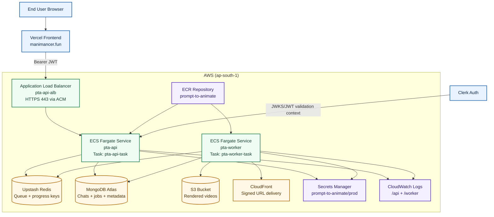
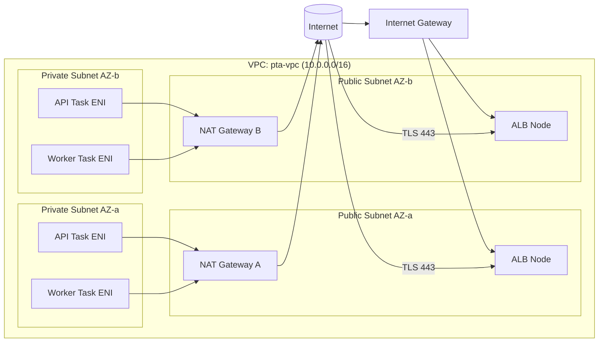
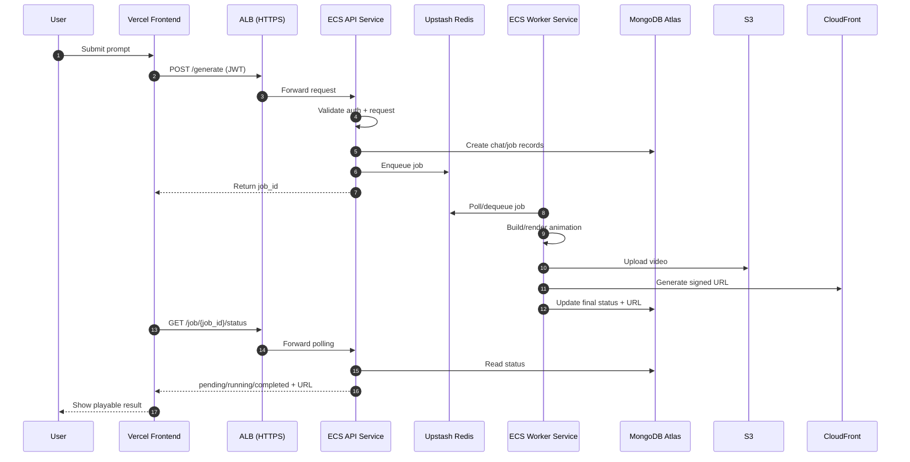
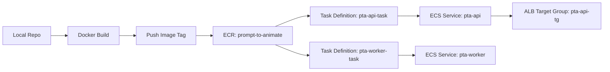

# Prompt to Animate: AWS Backend Architecture (What We Built and Why)

This document explains the **final backend architecture** you deployed, in concept-first language.

It is intentionally **not** a setup guide. It focuses on:
1. What each component is.
2. How requests flow through the system.
3. Why each AWS resource was needed.
4. How the design choices fit together.

Current DNS note:
1. `api.manimancer.fun` DNS is managed in **Vercel DNS**.
2. **Route53 was not used** in the deployed path.

---

## 1) Full System Architecture (High-Level)



---

## 2) Network Topology (Inside AWS)



### Why this network matters
1. ALB is public, so users can reach your API domain.
2. API and Worker tasks stay private, reducing attack surface.
3. NAT gateways let private tasks call external services (Upstash, Atlas, LLM APIs, Clerk JWKS) without giving tasks public IPs.

---

## 3) Runtime Flow (What Happens During Generation)



### Core idea
- API is the control plane (auth, validation, orchestration).
- Worker is the execution plane (heavy rendering and upload).
- Redis decouples request intake from long-running processing.

---

## 4) Deployment Artifact Flow (How Code Becomes Running Services)



### Why ECR is important
- ECS does not run source code directly.
- ECS always runs an image digest/tag pulled from ECR.

---

## 5) Resource-by-Resource Explanation

| Resource | What it is | Why it was needed | Scope |
|---|---|---|---|
| `pta-vpc` | Isolated virtual network | Separates backend infra from AWS default network | Regional |
| Public Subnets (2 AZs) | Internet-routable subnets | Host ALB and NAT gateways | VPC |
| Private Subnets (2 AZs) | No direct internet ingress | Run API/Worker tasks safely | VPC |
| Internet Gateway | Public internet entry/exit for VPC | Required for ALB internet access | VPC |
| NAT Gateway(s) | Outbound internet for private subnets | Lets ECS tasks call Atlas/Upstash/LLMs without public IP | AZ/VPC |
| `alb-sg` | ALB security group | Allows inbound 80/443 from internet | VPC |
| `api-task-sg` | API task security group | Allows app port from ALB SG only | VPC |
| `worker-task-sg` | Worker task security group | No public ingress; outbound-only behavior | VPC |
| `pta-api-tg` | ALB target group | Health-checks API tasks and forwards traffic | Regional |
| `pta-api-alb` | Application Load Balancer | Public entrypoint and TLS termination | Regional |
| ACM Certificate (`api.manimancer.fun`) | Managed TLS certificate | Enables HTTPS on ALB listener 443 | Regional |
| ECR `prompt-to-animate` | Private container registry | Stores versioned backend images | Regional |
| ECS Cluster `pta-cluster` | Logical container runtime boundary | Home for API and Worker services | Regional |
| Task Definition `pta-api-task` | API runtime template | Defines image, CPU/RAM, logs, secrets, port 8000 | Regional |
| Task Definition `pta-worker-task` | Worker runtime template | Defines worker command, resources, logs, secrets | Regional |
| ECS Service `pta-api` | Long-running API deployment | Keeps desired API tasks running and attached to ALB | Regional |
| ECS Service `pta-worker` | Long-running worker deployment | Keeps queue consumers always available | Regional |
| Secrets Manager `prompt-to-animate/prod` | Central secret store | Injects env vars securely into both tasks | Regional |
| CloudWatch Log Groups | Centralized logs | Needed for debugging crash loops and runtime failures | Regional |
| S3 bucket (video storage) | Object storage | Persists rendered output artifacts | Regional/Global access |
| CloudFront distribution | CDN delivery | Low-latency playback via signed URLs | Global |

---

## 6) Identity and Security Model

```mermaid
flowchart TB
    DeployUser[Deployment IAM User] -->|Push image / manage ECS / infra| AWSAPI[AWS APIs]

    subgraph Runtime[Runtime identities]
        ExecRole[ecsTaskExecutionRole-pta]
        TaskRole[ptaTaskRole]
    end

    ExecRole -->|Pull image| ECR
    ExecRole -->|Read secret values| SM[Secrets Manager]
    ExecRole -->|Write container logs| CW[CloudWatch Logs]

    TaskRole -->|App-level AWS calls (future-ready)| S3

    SG1[alb-sg] --> SG2[api-task-sg]
    SG3[worker-task-sg] --> Outbound[Outbound Internet via NAT only]
```

### Security intent
1. Secrets are not hardcoded in images or task definitions.
2. Public traffic stops at ALB; private tasks are not internet-exposed.
3. Security groups enforce least-access between components.
4. Logs and secrets access happen through IAM roles, not manual SSH patterns.

---

## 7) Why Two ECS Services (API + Worker)

| Single service model | Two-service model (what you used) |
|---|---|
| Long render jobs block request threads | API stays responsive, worker handles heavy jobs |
| Hard to scale reads vs processing separately | Scale API and Worker independently |
| Higher chance of timeouts under load | Queue smooths spikes and improves reliability |
| Harder fault isolation | Worker failures do not immediately take API down |

This is the key reason your architecture is production-oriented.

---

## 8) Domain and DNS Reality in Your Deployment

You used:
1. `api.manimancer.fun` pointing to ALB.
2. ACM DNS validation CNAME record.
3. DNS currently managed outside Route53 (Vercel DNS path).

So the runtime edge is still AWS ALB + ACM, while authoritative DNS is external.

---

## 9) What This Architecture Guarantees

1. HTTPS API endpoint with managed certificate.
2. Async job processing for heavy rendering workloads.
3. Private compute layer with controlled ingress.
4. Centralized logs and secret management.
5. Decoupled storage and delivery (S3 + CloudFront).
6. Clear separation between deployment pipeline (ECR/ECS) and runtime data plane (Redis/Mongo/S3).

---

## 10) Concept Glossary (Quick Revision)

| Term | Meaning in this project |
|---|---|
| ALB | Public HTTPS gateway for API traffic |
| Target Group | Dynamic list of healthy API task IPs |
| ECS Service | Auto-healing controller keeping tasks running |
| Task Definition | Immutable run template for a container workload |
| Fargate | Serverless compute engine for ECS tasks |
| NAT Gateway | Outbound internet bridge for private subnets |
| Secrets Manager | Secure env-var source for containers |
| Redis Queue | Job buffer between API and Worker |
| Atlas | Persistent metadata store for chats/jobs/status |
| S3 + CloudFront | Artifact storage + low-latency distribution |

---

## 11) AWS Terms Deep Dive: Networking

| Term | Plain-English meaning | Where it appeared in your deployment | Why it mattered |
|---|---|---|---|
| Region (`ap-south-1`) | Physical AWS geography where resources live | ECS, ALB, ACM, ECR, Logs, Secrets | Cross-region mismatch breaks integrations (for example ALB and ACM must match region) |
| Availability Zone (AZ) | Separate data-center zone inside one region | Public/private subnets in two AZs | Multi-AZ gives higher resilience if one zone has issues |
| VPC | Your private AWS network boundary | `pta-vpc` | Foundation for subnetting, routing, and security controls |
| CIDR block | IP range assigned to a network | `10.0.0.0/16` VPC and `/20` subnets | Prevents overlapping networks and controls IP capacity |
| Public subnet | Subnet with route to Internet Gateway | ALB and NAT placement | Required for internet-facing ALB |
| Private subnet | Subnet without direct inbound internet route | API/worker tasks | Keeps compute non-public and safer |
| Route table | Rules for where subnet traffic goes | Public route to IGW, private route to NAT | Determines whether tasks can receive traffic or only send outbound |
| Internet Gateway (IGW) | VPC attachment for direct internet traffic | Public subnet routing | Required so ALB can receive traffic from users |
| NAT Gateway | Outbound internet for private subnets | Worker/API outbound to Upstash/Atlas/LLMs | Private tasks can call internet APIs without public IP |
| ENI | Virtual network interface attached to a task | Fargate task network identity | Each task gets private IP + SG enforcement via ENI |
| Security Group (SG) | Stateful virtual firewall | `alb-sg`, `api-task-sg`, `worker-task-sg` | Defines exactly who can talk to what |

---

## 12) AWS Terms Deep Dive: ECS and Containers

| Term | Plain-English meaning | Where it appeared in your deployment | Why it mattered |
|---|---|---|---|
| ECS Cluster | Logical home for services/tasks | `pta-cluster` | Groups API and worker runtime under one control plane |
| Fargate launch type | Serverless mode for running containers | API and worker services | No EC2 host management needed |
| Task Definition | Immutable runtime spec for a container workload | `pta-api-task`, `pta-worker-task` | Defines image, CPU/memory, command, logs, secrets |
| Task Definition revision | Versioned snapshot of task definition | `:1`, `:2`, etc | Safe roll-forward and rollback control |
| ECS Service | Desired-state controller for tasks | `pta-api`, `pta-worker` | Keeps tasks running and replaces failed tasks automatically |
| Desired count | Number of tasks service should keep running | `1` for API and worker initially | Directly controls baseline capacity |
| Deployment rollout | Process of replacing old tasks with new ones | Service updates and force-deploys | Determines downtime behavior and release safety |
| Target Group | Health-aware backend pool for load balancer | `pta-api-tg` | ALB forwards only to healthy API tasks |
| Listener | ALB port/protocol entrypoint with routing action | `HTTP:80`, `HTTPS:443` | 80 redirects to 443; 443 forwards to API |
| Health check path | Endpoint ALB probes for liveliness | `/health` | Wrong path/status causes tasks to be marked unhealthy |
| Health check grace period | Warmup window before strict health checks | API service create/update | Prevents startup false negatives |
| Service-linked role | AWS-managed role some services auto-require | ECS cluster creation | Missing role can block cluster creation |

---

## 13) AWS Terms Deep Dive: IAM and Access

| Term | Plain-English meaning | Where it appeared in your deployment | Why it mattered |
|---|---|---|---|
| Root user | Account owner identity | Console login context early in setup | Should not be used for routine deployment operations |
| IAM user | Named identity with access keys/policies | Deployment user used by AWS CLI | Safer day-to-day automation identity |
| Managed policy | Reusable AWS or customer policy document | Temporary admin/broad setup permissions | Fast bootstrap, but should later be narrowed |
| Inline policy | Policy embedded directly on one user/role | Runtime S3 and secret-read controls | Good for scoped project-specific permissions |
| Execution role | Role used by ECS agent while starting container | `ecsTaskExecutionRole-pta` | Pulls from ECR, reads secrets, writes logs |
| Task role | Role assumed by app code inside container | `ptaTaskRole` | Future-ready for app-level AWS API calls |
| ARN | Global unique resource identifier in AWS | Secrets ARN, role ARN, target group ARN | Required for explicit cross-service linking |
| `iam:PassRole` concept | Permission to let a service use a role | ECS service/task wiring | Without pass-role, ECS cannot assume selected roles |
| Secrets Manager JSON key mapping | Map one JSON key to one env variable | Task definition secret entries | Wrong key names break app startup |

---

## 14) AWS Terms Deep Dive: TLS, DNS, and Certificates

| Term | Plain-English meaning | Where it appeared in your deployment | Why it mattered |
|---|---|---|---|
| ACM | AWS certificate manager | HTTPS certificate for `api.manimancer.fun` | Enables managed TLS without Certbot on instances |
| DNS validation | Prove domain ownership by adding a DNS record | ACM certificate issuance | Certificate stays pending until validation resolves |
| CNAME record | DNS alias from one name to another | `api` -> ALB DNS and ACM validation record | Core mechanism for routing and cert validation |
| CAA record | DNS policy for which CAs may issue certs | ACM CAA failure you hit | Blocking Amazon CA causes certificate issuance failure |
| TLS termination | Decrypt HTTPS at ALB, forward to backend | ALB 443 listener | Centralized HTTPS handling and simpler app config |
| Authoritative DNS provider | Where domain records are controlled | Vercel DNS in your deployed path | You must create routing and ACM records there |

---

## 15) AWS Terms Deep Dive: Observability and Day-2 Ops

| Term | Plain-English meaning | Where it appeared in your deployment | Why it mattered |
|---|---|---|---|
| CloudWatch Log Group | Container log bucket by app/service | `/ecs/prompt-to-animate/api`, `/worker` | First place to debug startup/runtime failures |
| CloudWatch Log Stream | Per-task log stream inside group | ECS task logs | Lets you isolate one crashing task's output |
| Force new deployment | Restart tasks on same task definition | ECS service update action | Useful after secret update or transient failures |
| Rollback | Move service to previous stable revision | ECS service/task definition history | Fast recovery path if new release is broken |
| Healthy target | Target group endpoint passing checks | ALB -> API target status | Public API works only when at least one target is healthy |
| 0/1 running transient | Service still converging after create/update | ECS service events | Not always failure; often rollout in progress |

---

## 16) Architecture Summary in One Line

You built a private, two-service ECS/Fargate backend behind an HTTPS ALB, with external queue/database providers (Upstash + Atlas), secure secret injection, S3/CloudFront delivery, and DNS managed in Vercel.
