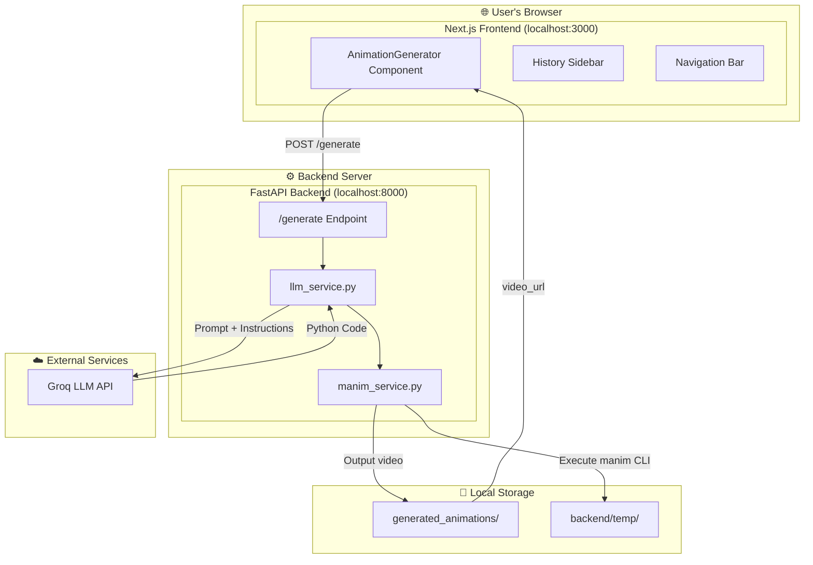
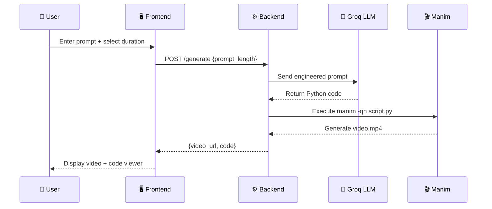
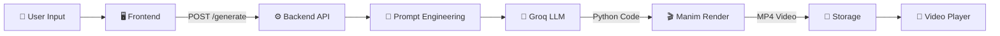

# 🎬 Manimancer

> **Turn your ideas into stunning 2D animations with AI.**

Manimancer is a full-stack web application that generates high-quality educational animations from simple text prompts. Powered by AI (Groq LLM) and the Manim library, it transforms your concepts into professional visualizations in seconds.

---

## 📋 Table of Contents

- [Features](#-features)
- [Architecture](#-architecture)
- [Tech Stack](#-tech-stack)
- [Project Structure](#-project-structure)
- [Getting Started](#-getting-started)
- [How It Works](#-how-it-works)
- [Configuration](#-configuration)
- [Example Prompts](#-example-prompts)
- [Troubleshooting](#-troubleshooting)
- [License](#-license)

---

## ✨ Features

- 🪄 **AI-Powered Generation** — Describe what you want in plain English, and the AI writes production-ready Manim code
- 🎥 **High-Quality Output** — Videos rendered at 1920×1080 @ 60fps for crisp, smooth animations
- ⏱️ **Configurable Duration** — Choose from Short (5s), Medium (15s), Long (1m), or Deep Dive (2m+)
- 📜 **Code Transparency** — Inspect the generated Manim Python code powering your animation
- 💾 **One-Click Download** — Save your creations directly to your device
- 🌗 **Dark Mode** — Beautiful glassmorphic UI with full dark mode support
- 📱 **Responsive Design** — Works seamlessly on desktop and mobile devices
- 📚 **History Sidebar** — Browse and replay your previously generated animations

---

##  Architecture

### High-Level System Architecture



### Request Flow Sequence



---

## 🛠️ Tech Stack

### Frontend

| Technology | Version | Purpose |
|:-----------|:--------|:--------|
| Next.js | 16 | React framework with App Router |
| React | 19 | UI component library |
| TailwindCSS | 4 | Utility-first CSS framework |
| Framer Motion | Latest | Smooth animations and transitions |
| Lucide React | Latest | Beautiful icon library |
| next-themes | Latest | Dark mode support |

### Backend

| Technology | Version | Purpose |
|:-----------|:--------|:--------|
| Python | 3.12 | Backend runtime |
| FastAPI | Latest | Modern async web framework |
| Uvicorn | Latest | ASGI server |
| LangChain Groq | Latest | LLM integration |
| Manim CE | Latest | Mathematical animation engine |

### AI/LLM

| Component | Details |
|:----------|:--------|
| Provider | Groq Cloud |
| Model | `moonshotai/kimi-k2-instruct-0905` |
| Temperature | 0.0 (Deterministic output) |

---

## 📁 Project Structure

```
prompt_to_animate/
│
├── .env                          # ⚠️ YOU CREATE THIS (contains GROQ_API_KEY)
├── .gitignore                    # Git ignore rules
├── README.md                     # This file
│
├── backend/                      # Python Backend
│   ├── __init__.py               # Package marker
│   ├── main.py                   # FastAPI app & endpoints
│   ├── llm_service.py            # Prompt engineering & LLM calls
│   ├── manim_service.py          # Manim execution & video processing
│   ├── temp/                     # 🔄 AUTO-GENERATED (temp scripts)
│   │   └── .gitkeep              # Preserves folder in git
│   └── venv/                     # 🔄 AUTO-GENERATED (virtual environment)
│
├── frontend/                     # Next.js Frontend
│   ├── app/                      # Next.js App Router
│   │   ├── layout.tsx            # Root layout with providers
│   │   ├── page.tsx              # Main page
│   │   └── globals.css           # Global styles
│   ├── components/               # React components
│   │   ├── AnimationGenerator.tsx
│   │   ├── Navbar.tsx
│   │   ├── Sidebar.tsx
│   │   ├── Footer.tsx
│   │   ├── Logo.tsx
│   │   └── ThemeProvider.tsx
│   ├── lib/                      # Utilities
│   │   └── utils.ts
│   ├── public/                   # Static assets
│   ├── node_modules/             # 🔄 AUTO-GENERATED (npm packages)
│   └── .next/                    # 🔄 AUTO-GENERATED (build cache)
│
└── generated_animations/         # 🔄 AUTO-GENERATED (output videos)
    └── .gitkeep                  # Preserves folder in git
```

### File Legend

| Symbol | Meaning |
|:-------|:--------|
| ⚠️ | You must create this manually |
| 🔄 | Auto-generated during setup/runtime (not tracked in git) |

> **Note:** All 🔄 folders are automatically created when you run setup commands or use the app. You don't need to create them manually!

---

## 🚀 Getting Started

### Prerequisites

| Requirement | Version | Check Command | Installation |
|:------------|:--------|:--------------|:-------------|
| Python | 3.10+ | `python --version` | [python.org](https://www.python.org/downloads/) |
| Node.js | 18+ | `node --version` | [nodejs.org](https://nodejs.org/) |
| npm | 9+ | `npm --version` | Comes with Node.js |
| FFmpeg | Latest | `ffmpeg -version` | [ffmpeg.org](https://ffmpeg.org/download.html) |
| LaTeX | Optional | `latex --version` | [MiKTeX](https://miktex.org/) or [TeX Live](https://www.tug.org/texlive/) |

> **Why FFmpeg?** Manim uses FFmpeg to encode video frames into MP4 files.
>
> **Why LaTeX?** Optional, but required for mathematical equations (`MathTex`).

### Step-by-Step Setup

#### 1️⃣ Clone the Repository

```bash
git clone https://github.com/Aafimalek/prompt_to_animate.git
cd prompt_to_animate
```

#### 2️⃣ Set Up the Backend

```bash
# Navigate to backend directory
cd backend

# Create Python virtual environment (auto-generates venv/)
python -m venv venv

# Activate the virtual environment
# Windows:
.\venv\Scripts\activate
# macOS/Linux:
source venv/bin/activate

# Install Python dependencies
pip install fastapi uvicorn langchain-groq python-dotenv manim

# Return to project root
cd ..
```

#### 3️⃣ Configure Environment Variables

Create a `.env` file in the **project root** directory:

```env
GROQ_API_KEY=your_api_key_here
```

> 🔑 **Get your FREE API key:** Visit [console.groq.com](https://console.groq.com/) → Sign up → Create API Key

#### 4️⃣ Set Up the Frontend

```bash
# Navigate to frontend directory
cd frontend

# Install Node.js dependencies (auto-generates node_modules/)
npm install

# Return to project root
cd ..
```

#### 5️⃣ Run the Application

Open **two terminal windows**:

**Terminal 1 — Backend Server:**

```bash
# From project root (Windows)
backend\venv\Scripts\python.exe -m uvicorn backend.main:app --reload --port 8000

# From project root (macOS/Linux)
backend/venv/bin/python -m uvicorn backend.main:app --reload --port 8000
```

**Terminal 2 — Frontend Dev Server:**

```bash
cd frontend
npm run dev
```

#### 6️⃣ Open the App

Navigate to **http://localhost:3000** in your browser.

---

## ⚙️ How It Works

### Generation Pipeline



### Duration Mapping

| Selection | Target Duration | LLM Instructions |
|:----------|:----------------|:-----------------|
| Short (5s) | 5-10 seconds | Single visual impact, minimal text |
| Medium (15s) | 15-20 seconds | 2-3 clear steps, moderate pacing |
| Long (1m) | ~60 seconds | 4-5 sections, detailed step-by-step |
| Deep Dive (2m) | 120+ seconds | 6-8 phases, full tutorial with examples |

---

## 🎛️ Configuration

### Video Quality Settings

Edit `backend/manim_service.py` (line 43):

```python
cmd = [
    sys.executable, "-m", "manim",
    "-qh",  # ◀ Change this flag
    ...
]
```

| Flag | Quality | Resolution | FPS | Use Case |
|:-----|:--------|:-----------|:----|:---------|
| `-ql` | Low | 480p | 15 | Fast previews |
| `-qm` | Medium | 720p | 30 | Development |
| `-qh` | High | 1080p | 60 | **Production (default)** |
| `-qk` | 4K | 2160p | 60 | Ultra quality (slow) |

### LLM Model Settings

Edit `backend/llm_service.py`:

```python
llm = ChatGroq(
    model="moonshotai/kimi-k2-instruct-0905",  # Change model here
    api_key=api_key,
    temperature=0.0  # 0.0 = deterministic, 1.0 = creative
)
```

---

## 🧪 Example Prompts

### Mathematics

| Prompt | Duration |
|:-------|:---------|
| A circle with its radius and area formula appearing | Short (5s) |
| Visualize the Pythagorean theorem with colored squares | Medium (15s) |
| Explain how derivatives work with a tangent line animation | Long (1m) |

### Computer Science

| Prompt | Duration |
|:-------|:---------|
| Show binary search finding a number in a sorted array | Medium (15s) |
| Animate how a stack data structure works (push/pop) | Medium (15s) |
| Complete tutorial on how merge sort algorithm works | Deep Dive (2m) |

### Physics

| Prompt | Duration |
|:-------|:---------|
| A pendulum swinging back and forth | Short (5s) |
| Visualize Newton's laws of motion with examples | Long (1m) |

---

## 🔧 Troubleshooting

### Common Issues

| Issue | Solution |
|:------|:---------|
| "GROQ_API_KEY not found" | Ensure `.env` file exists in project root with valid key |
| "Manim command not found" | Run `pip install manim` in activated venv |
| "FFmpeg not found" | Install FFmpeg and add to system PATH |
| Video not generating | Check backend terminal for Manim error messages |
| Port 8000 already in use | Kill existing process or use `--port 8001` |
| Frontend can't connect | Ensure backend is running on port 8000 |

### Debug Commands

```bash
# Check if Manim is installed correctly
manim --version

# Test Manim rendering
manim -pql -o test test_scene.py

# Check Python environment
pip list | grep manim
pip list | grep langchain

# Verify API key is set (Linux/Mac)
echo $GROQ_API_KEY

# Verify API key is set (Windows CMD)
echo %GROQ_API_KEY%
```

---

## 📝 License

This project is open-source and available under the [MIT License](LICENSE).

---

## 🙏 Acknowledgements

- [Manim Community](https://www.manim.community/) — The incredible animation engine
- [Groq](https://groq.com/) — Ultra-fast LLM inference
- [3Blue1Brown](https://www.3blue1brown.com/) — Inspiration for mathematical visualizations
- [Next.js](https://nextjs.org/) — React framework
- [TailwindCSS](https://tailwindcss.com/) — Styling framework

---

<p align="center">
  <strong>Made with ❤️ for the open-source community</strong>
</p>

<p align="center">
  <a href="https://github.com/yourusername/prompt_to_animate">⭐ Star this repo</a> •
  <a href="https://github.com/yourusername/prompt_to_animate/issues">🐛 Report Bug</a> •
  <a href="https://github.com/yourusername/prompt_to_animate/issues">✨ Request Feature</a>
</p>
