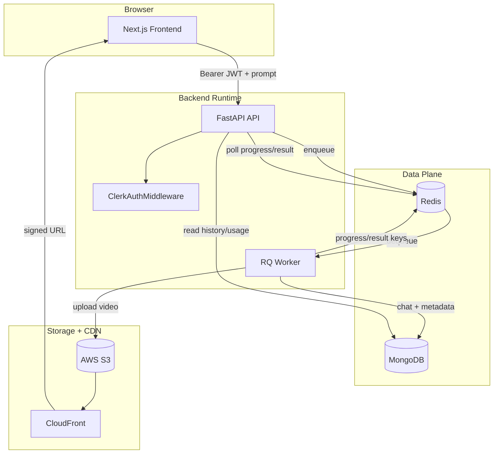
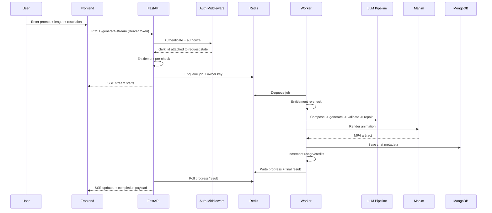
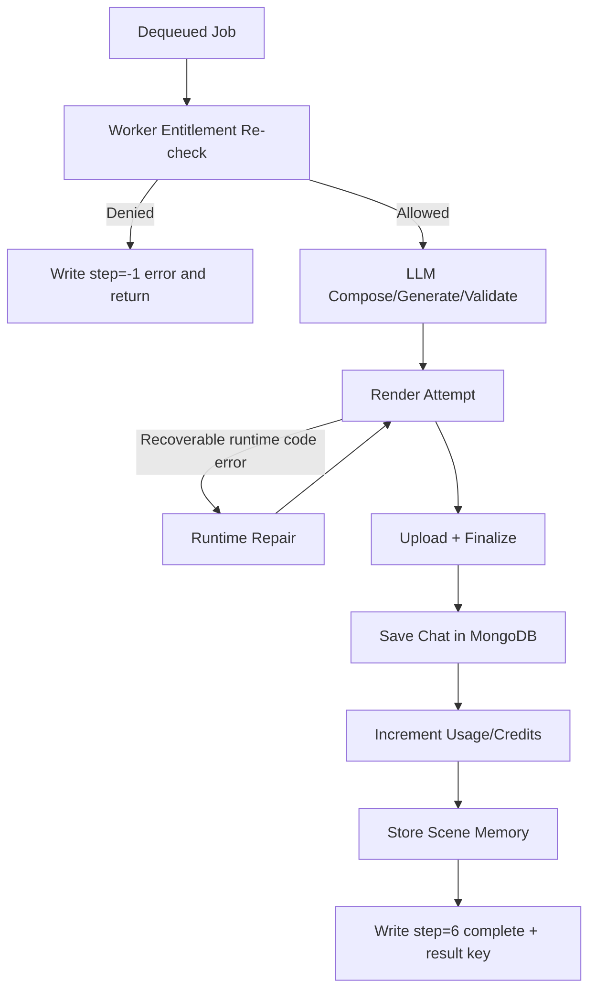
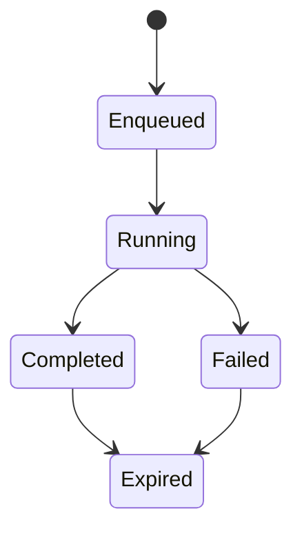
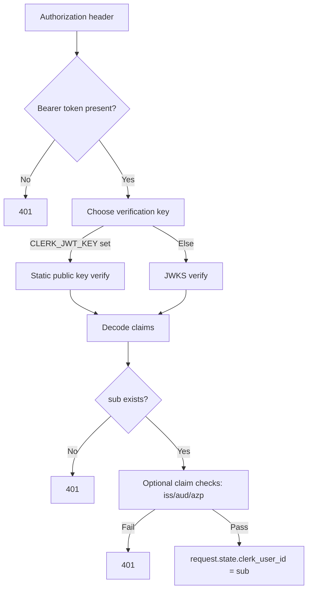
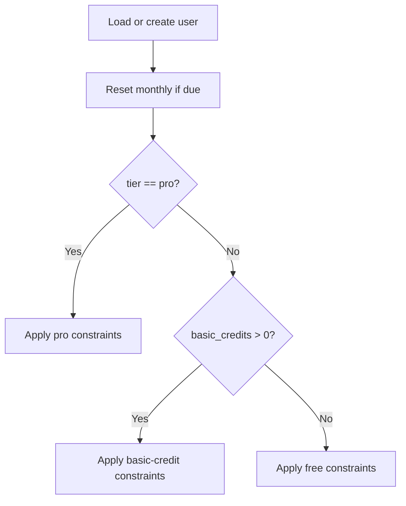
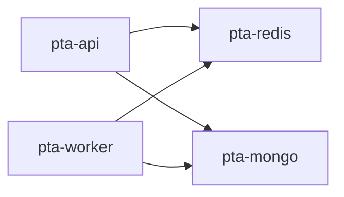

# Manimancer

> **Turn your ideas into high-quality educational animations with AI.**

**Live Frontend:** [www.manimancer.fun](https://www.manimancer.fun)

Manimancer is a full-stack prompt-to-video platform that transforms plain-English ideas into rendered Manim animations.  
It combines a Next.js frontend, a FastAPI backend, Redis-backed RQ workers, Clerk authentication, MongoDB persistence, and S3/CloudFront video delivery.

---

## Table of Contents

- [Features](#features)
- [Major Upgrades Implemented](#major-upgrades-implemented)
- [System Architecture](#system-architecture)
- [Backend Architecture (Technical)](#backend-architecture-technical)
- [Redis + Worker Architecture (Technical)](#redis--worker-architecture-technical)
- [Authentication and Security Model](#authentication-and-security-model)
- [Plans, Credits, and Entitlement Enforcement](#plans-credits-and-entitlement-enforcement)
- [API Reference (Current)](#api-reference-current)
- [Tech Stack](#tech-stack)
- [Project Structure](#project-structure)
- [Getting Started (Local)](#getting-started-local)
- [Docker Deployment (Local)](#docker-deployment-local)
- [Deployment Notes](#deployment-notes)
- [Configuration Reference](#configuration-reference)
- [Testing Checklist](#testing-checklist)
- [Troubleshooting](#troubleshooting)
- [Documentation Accuracy Notes](#documentation-accuracy-notes)

---

## Features

| Feature | Description |
|:--------|:------------|
| **AI-Powered Generation** | Prompt-to-Manim pipeline with multi-candidate generation, scoring, validation, and repair |
| **Real-Time Progress (SSE)** | Live step-by-step updates (`analyzing -> composing -> generating -> validating -> rendering -> complete`) |
| **Tier-Aware Resolution Controls** | 720p / 1080p / 4k with server-enforced entitlement checks |
| **Length-Aware Generation** | Medium (15s), Long (1m), Deep Dive (2m), Extended (5m) |
| **Code Transparency** | Generated Manim code is returned and viewable in UI |
| **Authentication Required for Generation** | Anonymous users are blocked and prompted to sign in/up via Clerk modal |
| **Hardened API Security** | Clerk JWT verification (`iss`/`azp`/optional `aud`) + route-level authorization checks |
| **Rate Limiting** | Redis-backed per-user + per-IP throttling for generation and status endpoints |
| **Per-User History** | Chat/video/code metadata persisted in MongoDB |
| **Cloud Delivery** | Rendered videos uploaded to S3 and delivered via CloudFront signed URLs |
| **Queue-Based Scaling** | Redis + RQ decouple API responsiveness from render-heavy workloads |
| **Payments + Plan Upgrades** | Dodo Payments checkout/webhook flow updates usage entitlements |

---

## Major Upgrades Implemented

### Product / UX Upgrades

- Removed generator mode selectors from active UI flow:
  - style mode
  - voiceover mode
  - export mode
- Removed scene editor from active user flow.
- Added signed-out guard in frontend generation action:
  - anonymous users now see prompt to sign in/up,
  - generation request is not sent until authenticated.

### Security Upgrades

- Added global Clerk auth middleware in backend (`backend/auth.py`).
- Added JWT claim hardening support:
  - `CLERK_ISSUER` (`iss` validation)
  - `CLERK_AUTHORIZED_PARTIES` (`azp` validation)
  - `CLERK_JWT_AUDIENCE` (`aud` validation when configured)
- Added static key verification path using `CLERK_JWT_KEY` (networkless verification) with JWKS fallback.
- Tightened CORS with explicit allowlist (`CORS_ALLOWED_ORIGINS`) and optional regex.
- Added job ownership enforcement (`job:{job_id}:owner`) for status reads.
- Added per-user/per-IP Redis rate limits.

### Credits / Entitlement Correctness Upgrades

- Added strict server-side entitlement checks by:
  - tier
  - resolution
  - selected length
  - monthly limits
  - credit sufficiency
- Enforcement happens in **two places**:
  - before enqueue in API,
  - again in worker before expensive LLM/render steps.

---

## System Architecture

### Production Topology (Current Direction)

| Layer | Component |
|:------|:----------|
| Frontend | Next.js app on Vercel (`www.manimancer.fun`) |
| Auth Provider | Clerk |
| API | FastAPI service (`backend/main.py`) |
| Worker | RQ worker (`backend/worker.py`) |
| Queue + runtime counters | Redis |
| Database | MongoDB |
| Artifact Storage | AWS S3 |
| Video Delivery | CloudFront signed URLs |

### High-Level Architecture Diagram


```mermaid
flowchart TB
    subgraph Browser["Browser"]
        FE["Next.js Frontend"]
    end

    subgraph Backend["Backend Runtime"]
        API["FastAPI API"]
        AUTH["ClerkAuthMiddleware"]
        WKR["RQ Worker"]
    end

    subgraph DataPlane["Data Plane"]
        REDIS[(Redis)]
        MONGO[(MongoDB)]
    end

    subgraph Storage["Storage + CDN"]
        S3[(AWS S3)]
        CF["CloudFront"]
    end

    FE -->|Bearer JWT + prompt| API
    API --> AUTH
    API -->|enqueue| REDIS
    API -->|poll progress/result| REDIS

    REDIS -->|dequeue| WKR
    WKR -->|progress/result keys| REDIS
    WKR -->|chat + metadata| MONGO
    API -->|read history/usage| MONGO

    WKR -->|upload video| S3
    S3 --> CF
    CF -->|signed URL| FE
```

### Request Flow Sequence


```mermaid
sequenceDiagram
    participant U as User
    participant F as Frontend
    participant A as FastAPI
    participant M as Auth Middleware
    participant R as Redis
    participant W as Worker
    participant L as LLM Pipeline
    participant N as Manim
    participant D as MongoDB

    U->>F: Enter prompt + length + resolution
    F->>A: POST /generate-stream (Bearer token)
    A->>M: Authenticate + authorize
    M-->>A: clerk_id attached to request.state
    A->>A: Entitlement pre-check
    A->>R: Enqueue job + owner key
    A-->>F: SSE stream starts

    W->>R: Dequeue job
    W->>W: Entitlement re-check
    W->>L: Compose -> generate -> validate -> repair
    W->>N: Render animation
    N-->>W: MP4 artifact
    W->>D: Save chat metadata
    W->>W: Increment usage/credits
    W->>R: Write progress + final result

    A->>R: Poll progress/result
    A-->>F: SSE updates + completion payload
```

---

## Backend Architecture (Technical)

### Core Modules

| File | Responsibility |
|:-----|:---------------|
| `backend/main.py` | FastAPI app lifecycle, route handlers, SSE orchestration, queue enqueue |
| `backend/auth.py` | JWT verification, protected-route checks, claim enforcement, rate limits |
| `backend/redis_utils.py` | Redis client factories, queue helper, Redis key helpers |
| `backend/tasks.py` | Worker task pipeline, progress/result writes, usage increment |
| `backend/worker.py` | Worker bootstrap (`Worker`/`SimpleWorker`) |
| `backend/user_service.py` | User usage state, tier rules, credit accounting, entitlement checks |
| `backend/llm_service.py` | Multi-candidate generation/scoring, validation, auto-repair, optional visual QA |
| `backend/manim_service.py` | Render execution, timeout management, S3 upload path |
| `backend/database.py` | MongoDB Motor connection lifecycle |

### FastAPI Runtime Model

- Startup: connect to MongoDB.
- Shutdown: close MongoDB connection.
- Middleware:
  - `ClerkAuthMiddleware`
  - `CORSMiddleware` (explicit allowlist)
- Static local fallback mount:
  - `/videos` -> `generated_animations/`

### Protected Route Surface

Auth middleware protects these prefixes:

- `/generate`
- `/job/`
- `/usage/`
- `/chats/`
- `/feedback/`
- `/scene-memory/`
- `/export/`
- `/voiceover/`

Exemptions:

- `/health`
- `/webhook/payment`
- docs/openapi routes
- `/videos/*`

### Generation Pipeline (Backend Perspective)

1. Resolve authenticated Clerk user (`sub`).
2. Enforce entitlement gate (`check_can_generate_with_constraints`).
3. Enqueue task into Redis queue.
4. Track progress via Redis keys.
5. Stream progress over SSE.
6. Return final payload (`video_url`, `code`, `chat_id`) on completion.

### SSE Signature De-duplication

`main.py` emits SSE only when any of these changes:

- `step`
- `status`
- `message`

This avoids duplicate spam while preserving transitions inside same step.

---

## Redis + Worker Architecture (Technical)

### Why Two Redis Client Modes Exist

| Redis Client | `decode_responses` | Usage |
|:-------------|:-------------------|:------|
| Raw connection | `False` | Required by RQ for binary/pickled payloads |
| Decoded connection | `True` | JSON progress/result/owner keys + rate-limit counters |

### Queue Configuration

- Queue name: `default`
- Job function: `process_video_generation(...)`
- Typical enqueue options:
  - `job_timeout=600`
  - `result_ttl=3600`
  - `failure_ttl=3600`

### Redis Key Contract

| Key Pattern | Purpose |
|:------------|:--------|
| `job:{job_id}:owner` | Owner binding (`clerk_id`) for object-level authorization |
| `job:{job_id}:progress` | Latest progress state consumed by SSE polling |
| `job:{job_id}:result` | Final result/error payload |
| `rl:generate:user:{clerk_id}:{bucket}` | per-user generate rate limit counter |
| `rl:generate:ip:{ip}:{bucket}` | per-IP generate rate limit counter |
| `rl:job_status:user:{clerk_id}:{bucket}` | per-user status endpoint rate limit counter |
| `rl:job_status:ip:{ip}:{bucket}` | per-IP status endpoint rate limit counter |

### Worker Execution Pipeline


```mermaid
flowchart TD
    A[Dequeued Job] --> B[Worker Entitlement Re-check]
    B -->|Denied| X[Write step=-1 error and return]
    B -->|Allowed| C[LLM Compose/Generate/Validate]
    C --> D[Render Attempt]
    D -->|Recoverable runtime code error| E[Runtime Repair] --> D
    D --> F[Upload + Finalize]
    F --> G[Save Chat in MongoDB]
    G --> H[Increment Usage/Credits]
    H --> I[Store Scene Memory]
    I --> J[Write step=6 complete + result key]
```

### Worker Event Loop Design

`tasks.py` keeps a persistent process-level event loop to avoid Motor "event loop is closed" issues when running async DB calls inside worker jobs.

### Job Lifecycle State Machine


```mermaid
stateDiagram-v2
    [*] --> Enqueued
    Enqueued --> Running
    Running --> Completed
    Running --> Failed
    Completed --> Expired
    Failed --> Expired
```

---

## Authentication and Security Model

### AuthN Flow


```mermaid
flowchart TD
    A[Authorization header] --> B{Bearer token present?}
    B -->|No| E1[401]
    B -->|Yes| C[Choose verification key]
    C -->|CLERK_JWT_KEY set| D1[Static public key verify]
    C -->|Else| D2[JWKS verify]
    D1 --> F[Decode claims]
    D2 --> F
    F --> G{sub exists?}
    G -->|No| E2[401]
    G -->|Yes| H[Optional claim checks: iss/aud/azp]
    H -->|Fail| E3[401]
    H -->|Pass| I[request.state.clerk_user_id = sub]
```

### AuthZ Controls

- `resolve_authenticated_clerk_id(...)` ensures payload/path user identity matches token subject.
- `ensure_clerk_path_access(...)` enforces ownership for user-scoped endpoints.
- `/job/{job_id}/status` enforces owner check via Redis owner key.

### Claim Hardening Variables

- `CLERK_ISSUER`
- `CLERK_AUTHORIZED_PARTIES`
- `CLERK_JWT_AUDIENCE` (optional)
- `CLERK_JWT_KEY` (optional static key)
- `CLERK_JWKS_URL` (optional explicit JWKS override)

### Rate Limiting

Defaults from `auth.py`:

- generate endpoints: `RATE_LIMIT_GENERATE_PER_MINUTE` default `6`
- status endpoints: `RATE_LIMIT_STATUS_PER_MINUTE` default `120`
- per-IP threshold: `2x` user threshold

### CORS Posture

- Uses explicit `CORS_ALLOWED_ORIGINS` allowlist.
- Optional regex via `CORS_ALLOW_ORIGIN_REGEX`.
- Wildcard CORS is not the default posture for current code.

---

## Plans, Credits, and Entitlement Enforcement

> This section reflects **backend-enforced truth** in `backend/user_service.py`.

### Tier Rules (Canonical)

| Tier Path | Monthly Limit | Allowed Resolutions | Max Length | Consumption |
|:----------|:--------------|:--------------------|:-----------|:------------|
| Free | 5/month | 720p only | Long (1m) | increments `monthly_count` |
| Basic-credit path (`basic_credits > 0`) | N/A | 720p, 1080p, 4k | Extended (5m) | deducts by resolution cost |
| Pro | 50/month | 720p, 1080p, 4k | Extended (5m) | increments `monthly_count` |

### Resolution Cost Table

| Resolution | Cost |
|:-----------|:-----|
| 720p | 1.0 |
| 1080p | 1.0 |
| 4k | 2.5 (non-pro credit path) |

### Entitlement Decision Diagram


```mermaid
flowchart TD
    A[Load or create user] --> B[Reset monthly if due]
    B --> C{tier == pro?}
    C -->|Yes| P[Apply pro constraints]
    C -->|No| D{basic_credits > 0?}
    D -->|Yes| E[Apply basic-credit constraints]
    D -->|No| F[Apply free constraints]
```

### Enforcement Layers

- **Layer 1 (API):** Pre-enqueue deny path.
- **Layer 2 (Worker):** Re-check before expensive computation.

This dual gate prevents stale queued-job abuse.

### Reset Behavior

- Free path resets on the 1st of next month.
- Pro path resets 30 days from subscription activation.

---

## API Reference (Current)

### Base URLs

| Environment | URL |
|:------------|:----|
| Frontend (live) | `https://www.manimancer.fun` |
| Local backend | `http://localhost:8000` |
| Backend URL used by frontend | `NEXT_PUBLIC_API_URL` |

### Core Generation Endpoints

| Method | Path | Auth Required |
|:-------|:-----|:--------------|
| `POST` | `/generate-stream` | Yes |
| `POST` | `/generate` | Yes |
| `GET` | `/job/{job_id}/status` | Yes |
| `GET` | `/health` | No |

### User and Billing Endpoints

| Method | Path | Auth Required |
|:-------|:-----|:--------------|
| `GET` | `/usage/{clerk_id}` | Yes |
| `POST` | `/webhook/payment` | No (webhook/internal path) |

### History + Collaboration Endpoints

| Method | Path |
|:-------|:-----|
| `GET` | `/chats/{clerk_id}` |
| `GET` | `/chats/{clerk_id}/{chat_id}` |
| `DELETE` | `/chats/{clerk_id}/{chat_id}` |
| `POST` | `/chats/{clerk_id}/{chat_id}/comments` |
| `GET` | `/chats/{clerk_id}/{chat_id}/comments` |
| `POST` | `/chats/{clerk_id}/{chat_id}/variants` |
| `GET` | `/chats/{clerk_id}/{chat_id}/variants` |
| `POST` | `/chats/{clerk_id}/{chat_id}/branches` |
| `GET` | `/chats/{clerk_id}/{chat_id}/branches` |
| `POST` | `/chats/{clerk_id}/{chat_id}/branches/{branch_id}/merge` |
| `GET` | `/chats/{clerk_id}/{chat_id}/variants/{variant_id}/diff` |

### Advanced Endpoints

| Method | Path |
|:-------|:-----|
| `POST` | `/export/interactive` |
| `POST` | `/voiceover/subtitles` |
| `GET` | `/scene-memory/search` |
| `POST` | `/feedback/quality` |
| `POST` | `/feedback/quality/retrain` |

### `POST /generate-stream` Request Body (current frontend usage)

```json
{
  "prompt": "Explain Pythagorean theorem with squares",
  "length": "Medium (15s)",
  "resolution": "720p"
}
```

### SSE Completion Payload (shape)

```json
{
  "step": 6,
  "status": "complete",
  "message": "Video ready!",
  "video_url": "https://...",
  "code": "from manim import * ...",
  "chat_id": "..."
}
```

### `GET /usage/{clerk_id}` Response (shape)

```json
{
  "tier": "free",
  "used": 1,
  "limit": 5,
  "remaining": 4,
  "basic_credits": 0,
  "reset_date": "2026-04-01T00:00:00"
}
```

---

## Tech Stack

### Frontend

| Technology | Version |
|:-----------|:--------|
| Next.js | `^16.0.10` |
| React | `19.2.1` |
| TypeScript | `^5` |
| Clerk | `^6.36.2` |
| Framer Motion | `^12.23.25` |
| TailwindCSS | `^4` |
| Lucide React | `^0.556.0` |
| Dodo Payments SDK | `^0.3.1` |

### Backend

| Technology | Version Constraint |
|:-----------|:-------------------|
| Python | `3.10+` |
| FastAPI | `>=0.104.0` |
| Uvicorn | `>=0.24.0` |
| Redis | `>=5.0.0` |
| RQ | `>=1.16.0` |
| Motor | `>=3.3.0` |
| PyMongo | `>=4.6.0` |
| Manim CE | `>=0.18.0,<0.20.0` |
| PyJWT | `>=2.8.0` |
| Boto3 | `>=1.34.0` |
| Cryptography | `>=41.0.0` |

### LLM Providers (Current Implementation)

- Azure OpenAI (primary when configured)
- Groq fallback models
- Cerebras fallback model (when configured)

---

## Project Structure

```text
prompt_to_animate/
+-- .env
+-- README.md
+-- AWS_BACKEND_DEPLOYMENT_GUIDE.md
+-- docker-compose.yml
+-- Dockerfile
+-- generated_animations/
|
+-- backend/
|   +-- __init__.py
|   +-- main.py
|   +-- auth.py
|   +-- worker.py
|   +-- tasks.py
|   +-- redis_utils.py
|   +-- user_service.py
|   +-- llm_service.py
|   +-- manim_service.py
|   +-- database.py
|   +-- models.py
|   +-- prompts/
|   +-- tests/
|
+-- frontend/
    +-- .env.local
    +-- app/
    |   +-- layout.tsx
    |   +-- page.tsx
    |   +-- api/
    |       +-- checkout/route.ts
    |       +-- customer-portal/route.ts
    |       +-- webhook/dodo/route.ts
    +-- components/
    |   +-- AnimationGenerator.tsx
    |   +-- Sidebar.tsx
    |   +-- PricingModal.tsx
    |   +-- Navbar.tsx
    |   +-- Footer.tsx
    +-- lib/api.ts
```

---

## Getting Started (Local)

### Prerequisites

| Requirement | Version |
|:------------|:--------|
| Python | 3.10+ |
| Node.js | 18+ |
| npm | 9+ |
| FFmpeg | latest |

### 1) Clone Repository

```bash
git clone https://github.com/Aafimalek/prompt_to_animate.git
cd prompt_to_animate
```

### 2) Backend Setup

```bash
python -m venv backend/venv

# Windows
backend\venv\Scripts\activate

# macOS/Linux
# source backend/venv/bin/activate

pip install -r backend/requirements.txt
```

### 3) Start Backend API

```bash
uvicorn backend.main:app --host 0.0.0.0 --port 8000 --reload
```

### 4) Start Worker (new terminal)

```bash
# activate same venv first
python -m backend.worker
```

### 5) Frontend Setup + Run

```bash
cd frontend
npm install
npm run dev
```

Open: `http://localhost:3000`

---

## Docker Deployment (Local)

### Quick Start

```bash
docker-compose up --build
```

### Services

| Container | Purpose | Port |
|:----------|:--------|:-----|
| `pta-api` | FastAPI API service | `8000` |
| `pta-worker` | Background RQ worker | - |
| `pta-redis` | Queue + counters store | `6379` |
| `pta-mongo` | MongoDB persistence | `27017` |
| `pta-redis-ui` | Optional Redis Commander | `8081` |

### Docker Topology


```mermaid
flowchart LR
    API[pta-api] --> REDIS[pta-redis]
    API --> MONGO[pta-mongo]
    WORKER[pta-worker] --> REDIS
    WORKER --> MONGO
```

### Persistence Note

- `docker-compose down` preserves volumes.
- `docker-compose down -v` deletes volumes and stored local data.

---

## Deployment Notes

### Frontend

- Deployed on Vercel (`www.manimancer.fun`).
- Uses `NEXT_PUBLIC_API_URL` to point at backend URL.

### Backend + Worker

- API and worker must both run.
- If worker is down, jobs queue but generation never completes.

### AWS Deployment Runbook

For AWS production rollout details, use:

- [AWS_BACKEND_DEPLOYMENT_GUIDE.md](AWS_BACKEND_DEPLOYMENT_GUIDE.md)

---

## Configuration Reference

### Backend Security Variables

```env
CLERK_ISSUER=https://clerk.your-domain.com
CLERK_AUTHORIZED_PARTIES=https://www.your-frontend.com,http://localhost:3000,https://*.vercel.app
CLERK_JWT_AUDIENCE=
CLERK_JWT_KEY="-----BEGIN PUBLIC KEY-----\n...\n-----END PUBLIC KEY-----"
CLERK_JWKS_URL=https://clerk.your-domain.com/.well-known/jwks.json

CORS_ALLOWED_ORIGINS=https://www.your-frontend.com,http://localhost:3000
CORS_ALLOW_ORIGIN_REGEX=

RATE_LIMIT_GENERATE_PER_MINUTE=6
RATE_LIMIT_STATUS_PER_MINUTE=120
JOB_OWNER_TTL_SECONDS=3600
```

### Backend Core Variables

```env
MONGODB_URI=mongodb://localhost:27017
MONGODB_DATABASE=prompt_to_animate
REDIS_URL=redis://localhost:6379

AZURE_OPENAI_API_KEY=
AZURE_OPENAI_ENDPOINT=
AZURE_OPENAI_DEPLOYMENT=gpt-5.2-chat
GROQ_API_KEY=
CEREBRAS_API_KEY=

AWS_ACCESS_KEY_ID=
AWS_SECRET_ACCESS_KEY=
AWS_REGION=
S3_BUCKET_NAME=
CLOUDFRONT_DOMAIN=
CLOUDFRONT_KEY_PAIR_ID=
CLOUDFRONT_PRIVATE_KEY_PATH=./private_key.pem
```

### Frontend Variables

```env
NEXT_PUBLIC_API_URL=http://localhost:8000
NEXT_PUBLIC_CLERK_PUBLISHABLE_KEY=
CLERK_SECRET_KEY=

DODO_PAYMENTS_API_KEY=
DODO_PAYMENTS_WEBHOOK_KEY=
DODO_PAYMENTS_RETURN_URL=http://localhost:3000/
DODO_PAYMENTS_ENVIRONMENT=test_mode
```

---

## Testing Checklist

### Core Runtime

1. `GET /health` should show Redis + Mongo connected.
2. Start generation as signed-in user and verify SSE step progression.
3. Confirm worker logs show dequeue and completion.
4. Confirm generated video is playable.

### Security

1. Try generation without auth token -> should fail.
2. Try status check from non-owner account -> should return forbidden.
3. Burst generate requests -> should trigger rate limiting.

### Credits/Plans

1. Free user at limit should receive server-side denial.
2. Free user selecting locked resolution/length should be denied.
3. Basic credits should decrement by resolution cost.

---

## Troubleshooting

| Symptom | Likely Cause | Fix |
|:--------|:-------------|:----|
| `401 Missing Authorization header` | token not attached | ensure frontend sends `Authorization: Bearer ...` |
| `401 Invalid authorized party` | `azp` mismatch | update `CLERK_AUTHORIZED_PARTIES` |
| `403` on generation | entitlement denial | check `/usage/{clerk_id}` and selected resolution/length |
| `429` errors | rate limit exceeded | tune rate-limit env vars or reduce burst |
| SSE never completes | worker offline | run `python -m backend.worker` |
| `Job not found` / `Forbidden` on status | owner key missing/mismatch | retry with same signed-in user and valid job id |
| render timeout | scene too heavy | lower resolution/length or simplify prompt |
| history empty after login | token/path mismatch | verify `/chats/{clerk_id}` call includes valid bearer token |

---

## Documentation Accuracy Notes

This README is aligned with current implementation in:

- `backend/main.py`
- `backend/auth.py`
- `backend/tasks.py`
- `backend/worker.py`
- `backend/user_service.py`
- `backend/redis_utils.py`
- `backend/llm_service.py`
- `backend/manim_service.py`
- `frontend/components/AnimationGenerator.tsx`
- `frontend/app/page.tsx`
- `frontend/lib/api.ts`

If you update route contracts, security posture, or entitlement logic, update this README in the same PR.
