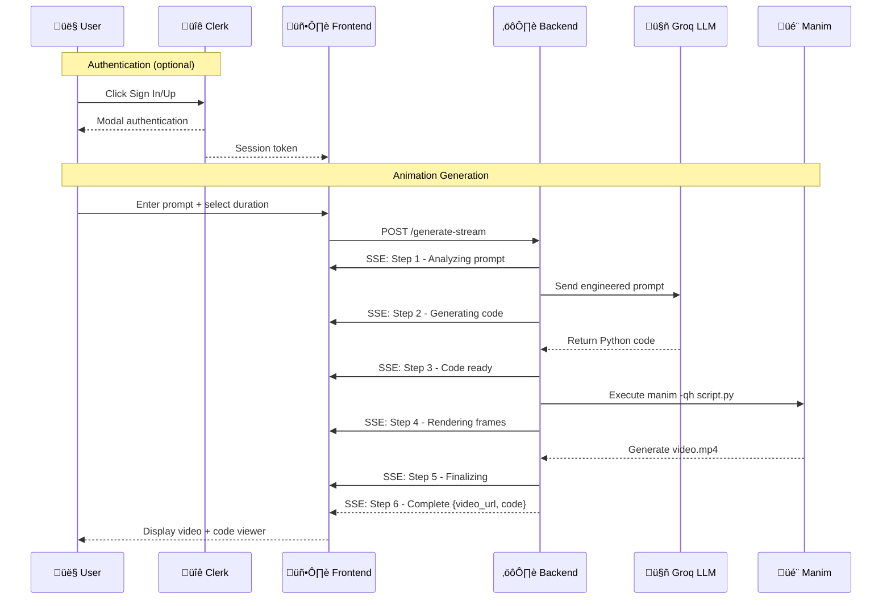

# 🎬 Manimancer

> **Turn your ideas into stunning 2D animations with AI.**

Manimancer is a full-stack web application that generates high-quality educational animations from simple text prompts. Powered by AI (Groq LLM) and the Manim library, it transforms your concepts into professional visualizations in seconds.

---

## 📋 Table of Contents

- [Features](#-features)
- [Demo](#-demo)
- [Architecture](#-architecture)
- [Tech Stack](#-tech-stack)
- [Project Structure](#-project-structure)
- [Getting Started](#-getting-started)
- [How It Works](#-how-it-works)
- [API Reference](#-api-reference)
- [Configuration](#-configuration)
- [Example Prompts](#-example-prompts)
- [Troubleshooting](#-troubleshooting)
- [License](#-license)

---

## ✨ Features

| Feature | Description |
|:--------|:------------|
| 🪄 **AI-Powered Generation** | Describe what you want in plain English, and the AI writes production-ready Manim code |
| 🎥 **High-Quality Output** | Videos rendered at **1920×1080 @ 60fps** for crisp, smooth animations |
| ⏱️ **Configurable Duration** | Choose from Short (5s), Medium (15s), Long (1m), or Deep Dive (2m+) |
| 📜 **Code Transparency** | Inspect the generated Manim Python code powering your animation |
| 💾 **One-Click Download** | Save your creations directly to your device |
| ☁️ **Cloud Storage (S3)** | Videos stored securely in AWS S3 with CloudFront CDN delivery |
| 🔐 **Signed URLs** | Time-limited, private access to videos via CloudFront signed URLs |
| 🔐 **User Authentication** | Secure sign-in/sign-up with Clerk (modal-based, no redirect) |
| 🌗 **Dark Mode** | Beautiful glassmorphic UI with full dark mode support |
| 📱 **Responsive Design** | Works seamlessly on desktop and mobile devices |
| 📚 **History Sidebar** | Browse and replay your previously generated animations |
| ⚡ **Real-Time Progress** | Server-Sent Events (SSE) provide live generation progress updates |

---

## 🎬 Demo

| Generate Animation | Progress Tracking |
|:-------------------|:------------------|
| Enter a prompt, select duration, click generate | Watch real-time progress through 6 stages |

### Animation Lengths

| Option | Duration | Best For |
|:-------|:---------|:---------|
| **Short (5s)** | 5-10 seconds | Quick concepts, single visualizations |
| **Medium (15s)** | 15-20 seconds | 2-3 step explanations |
| **Long (1m)** | 55-70 seconds | Detailed tutorials with multiple sections |
| **Deep Dive (2m+)** | 120+ seconds | Comprehensive lessons with examples |

---

## 🏗️ Architecture

### High-Level System Architecture

```mermaid
flowchart TB
    subgraph Browser["🌐 User's Browser"]
        subgraph Frontend["Next.js 16 Frontend (localhost:3000)"]
            Clerk["Clerk Auth<br/>(Sign In/Up Modal)"]
            UI["AnimationGenerator<br/>Component"]
            Sidebar["History Sidebar"]
            Navbar["Navigation Bar"]
        end
    end
    
    subgraph Server["⚙️ Backend Server"]
        subgraph FastAPI["FastAPI Backend (localhost:8000)"]
            API1["/generate<br/>(Standard POST)"]
            API2["/generate-stream<br/>(SSE Streaming)"]
            LLM["llm_service.py"]
            Manim["manim_service.py"]
        end
    end
    
    subgraph External["☁️ External Services"]
        Groq["Groq LLM API<br/>(Kimi K2 Model)"]
        ClerkAPI["Clerk API<br/>(Authentication)"]
    end
    
    subgraph Storage["☁️ Cloud Storage (AWS)"]
        S3["S3 Bucket<br/>(Private)"]
        CloudFront["CloudFront CDN<br/>(Signed URLs)"]
    end
    
    subgraph LocalStorage["💾 Local Storage (Temp)"]
        Videos["generated_animations/"]
        Temp["backend/temp/"]
    end
    
    Clerk --> ClerkAPI
    UI -->|"POST /generate-stream"| API2
    API2 --> LLM
    LLM -->|"Engineered Prompt"| Groq
    Groq -->|"Python Code"| LLM
    LLM --> Manim
    Manim -->|"Execute manim CLI"| Temp
    Manim -->|"Output video"| Videos
    Videos -->|"Upload"| S3
    S3 --> CloudFront
    CloudFront -->|"SSE: signed_url"| UI
```



### Request Flow Sequence



---

## 🛠️ Tech Stack

### Frontend

| Technology | Version | Purpose |
|:-----------|:--------|:--------|
| [Next.js](https://nextjs.org/) | 16.0.8 | React framework with App Router |
| [React](https://react.dev/) | 19.2.1 | UI component library |
| [TypeScript](https://www.typescriptlang.org/) | 5.x | Type-safe JavaScript |
| [TailwindCSS](https://tailwindcss.com/) | 4.x | Utility-first CSS framework |
| [Framer Motion](https://www.framer.com/motion/) | 12.x | Smooth animations and transitions |
| [Clerk](https://clerk.com/) | 6.36.2 | Authentication (modal-based sign in/up) |
| [Lucide React](https://lucide.dev/) | 0.556.0 | Beautiful icon library |
| [next-themes](https://github.com/pacocoursey/next-themes) | 0.4.6 | Dark mode support |

### Backend

| Technology | Version | Purpose |
|:-----------|:--------|:--------|
| [Python](https://www.python.org/) | 3.10+ | Backend runtime |
| [FastAPI](https://fastapi.tiangolo.com/) | Latest | Modern async web framework with SSE support |
| [Uvicorn](https://www.uvicorn.org/) | Latest | ASGI server |
| [LangChain Groq](https://python.langchain.com/) | Latest | LLM integration |
| [Manim CE](https://www.manim.community/) | Latest | Mathematical animation engine |
| [Boto3](https://boto3.amazonaws.com/v1/documentation/api/latest/index.html) | Latest | AWS SDK for Python (S3 uploads) |
| [Cryptography](https://cryptography.io/) | Latest | RSA signing for CloudFront URLs |
| [python-dotenv](https://github.com/theskumar/python-dotenv) | Latest | Environment variable management |

### AI/LLM

| Component | Details |
|:----------|:--------|
| **Provider** | [Groq Cloud](https://groq.com/) (ultra-fast inference) |
| **Model** | `moonshotai/kimi-k2-instruct-0905` |
| **Temperature** | 0.2 (slightly creative, but focused for consistent animations) |
| **Context** | Detailed system prompt with Manim best practices, timing guides, and visual standards |

---

## 📁 Project Structure

```
prompt_to_animate/
│
├── .env                              # ⚠️ Backend: GROQ_API_KEY
├── .gitignore                        # Git ignore rules
├── README.md                         # This file
│
├── backend/                          # 🐍 Python FastAPI Backend
│   ├── __init__.py                   # Package marker
│   ├── main.py                       # FastAPI app, routes (/generate, /generate-stream)
│   ├── llm_service.py                # Prompt engineering, Groq LLM integration
│   ├── manim_service.py              # Manim CLI execution, S3 upload integration
│   ├── s3_service.py                 # ⚠️ AWS S3 upload + CloudFront signed URL generation
│   ├── temp/                         # 🔄 Temporary Python scripts (auto-cleaned)
│   │   └── .gitkeep
│   └── venv/                         # 🔄 Python virtual environment
│
├── private_key.pem                   # ⚠️🔒 CloudFront RSA private key (DO NOT COMMIT)
├── public_key.pem                    # 🔄 CloudFront public key (uploaded to AWS)
│
├── frontend/                         # ⚛️ Next.js 16 Frontend
│   ├── .env.local                    # ⚠️ Frontend: Clerk API keys
│   ├── middleware.ts                 # Clerk authentication middleware
│   ├── app/                          # Next.js App Router
│   │   ├── layout.tsx                # Root layout (ClerkProvider, ThemeProvider)
│   │   ├── page.tsx                  # Main page
│   │   ├── globals.css               # Global styles & design tokens
│   │   ├── favicon.ico               # App icon
│   │   └── icon.svg                  # SVG icon
│   ├── components/                   # React Components
│   │   ├── AnimationGenerator.tsx    # Main generator with SSE progress
│   │   ├── Sidebar.tsx               # History sidebar + Clerk auth buttons
│   │   ├── Navbar.tsx                # Top navigation bar
│   │   ├── Footer.tsx                # Page footer
│   │   ├── Logo.tsx                  # Manimancer logo (Nabla font)
│   │   ├── ThemeProvider.tsx         # Dark mode provider
│   │   └── icons/                    # Custom SVG icons
│   ├── lib/                          # Utilities
│   │   └── utils.ts                  # cn() helper (clsx + tailwind-merge)
│   ├── public/                       # Static assets
│   ├── package.json                  # Node.js dependencies
│   ├── tsconfig.json                 # TypeScript configuration
│   ├── next.config.ts                # Next.js configuration
│   ├── postcss.config.mjs            # PostCSS configuration
│   ├── eslint.config.mjs             # ESLint configuration
│   ├── node_modules/                 # 🔄 npm packages
│   └── .next/                        # 🔄 Build cache
│
└── generated_animations/             # 🔄 Output videos (served at /videos/*)
    └── .gitkeep
```

### Legend

| Symbol | Meaning |
|:-------|:--------|
| ⚠️ | You must create/configure this file |
| 🔄 | Auto-generated (not tracked in git) |
| 🐍 | Python |
| ⚛️ | React/Next.js |

---

## 🚀 Getting Started

### Prerequisites

| Requirement | Version | Check Command | Installation |
|:------------|:--------|:--------------|:-------------|
| **Python** | 3.10+ | `python --version` | [python.org](https://www.python.org/downloads/) |
| **Node.js** | 18+ | `node --version` | [nodejs.org](https://nodejs.org/) |
| **npm** | 9+ | `npm --version` | Comes with Node.js |
| **FFmpeg** | Latest | `ffmpeg -version` | [ffmpeg.org](https://ffmpeg.org/download.html) |
| **LaTeX** | Optional | `latex --version` | [MiKTeX](https://miktex.org/) or [TeX Live](https://www.tug.org/texlive/) |

> **Why FFmpeg?** Manim uses FFmpeg to encode video frames into MP4 files.
> **Why LaTeX?** Optional, but required for mathematical equations (`MathTex`).

### Step-by-Step Setup

#### 1️⃣ Clone the Repository

```bash
git clone https://github.com/Aafimalek/prompt_to_animate.git
cd prompt_to_animate
```

#### 2️⃣ Set Up the Backend

```bash
# Navigate to backend directory
cd backend

# Create Python virtual environment
python -m venv venv

# Activate the virtual environment
# Windows:
.\venv\Scripts\activate
# macOS/Linux:
source venv/bin/activate

# Install Python dependencies
pip install fastapi uvicorn langchain-groq python-dotenv manim boto3 cryptography

# Return to project root
cd ..
```

#### 3️⃣ Configure Backend Environment

Create a `.env` file in the **project root**:

```env
# Groq LLM API Key
GROQ_API_KEY=your_groq_api_key_here

# AWS S3 Configuration
AWS_ACCESS_KEY_ID=your_access_key_id
AWS_SECRET_ACCESS_KEY=your_secret_access_key
AWS_REGION=ap-south-1
S3_BUCKET_NAME=your_bucket_name

# CloudFront Configuration
CLOUDFRONT_DOMAIN=your_distribution.cloudfront.net
CLOUDFRONT_KEY_PAIR_ID=your_key_pair_id
CLOUDFRONT_PRIVATE_KEY_PATH=./private_key.pem
```

> 🔑 **Get your FREE Groq API key:** [console.groq.com](https://console.groq.com/) → Sign up → Create API Key

> ☁️ **AWS credentials are optional for local development.** If not configured, videos will be served locally from `/videos/`.

#### 4️⃣ Set Up AWS S3 + CloudFront (Optional but Recommended)

For production deployments with secure, scalable video delivery:

**Step 1: Create S3 Bucket**
1. Go to [AWS S3 Console](https://s3.console.aws.amazon.com/s3/)
2. Click **Create bucket**
3. Name it (e.g., `manimancer-videos`)
4. **Block all public access**: Keep enabled (we'll use CloudFront)
5. Create the bucket

**Step 2: Create IAM User**
1. Go to **IAM** → **Users** → **Create user**
2. Name it (e.g., `manimancer-s3-user`)
3. Attach policies: `AmazonS3FullAccess`, `CloudFrontFullAccess`
4. Go to **Security credentials** → **Create access key**
5. Copy `Access Key ID` and `Secret Access Key` to your `.env`

**Step 3: Create CloudFront Distribution**
1. Go to [CloudFront Console](https://console.aws.amazon.com/cloudfront/)
2. Click **Create distribution**
3. **Origin domain**: Select your S3 bucket
4. **Origin access**: Select **Origin access control settings (recommended)**
5. Create a new OAC and update the S3 bucket policy when prompted
6. **Restrict viewer access**: **Yes**
7. Create a **key group** (see Step 4)
8. Create the distribution and copy the **Domain name** to your `.env`

**Step 4: Generate RSA Key Pair for Signed URLs**

```bash
# Generate private key (keep this secret!)
openssl genrsa -out private_key.pem 2048

# Generate public key (upload to CloudFront)
openssl rsa -pubout -in private_key.pem -out public_key.pem
```

**Step 5: Upload Public Key to CloudFront**
1. Go to **CloudFront** → **Key management** → **Public keys**
2. Click **Create public key**
3. Paste contents of `public_key.pem`
4. Copy the **Key ID** to your `.env` as `CLOUDFRONT_KEY_PAIR_ID`

**Step 6: Create Key Group**
1. Go to **CloudFront** → **Key management** → **Key groups**
2. Create a key group with your public key
3. Attach the key group to your distribution's behavior

> 🔒 **Security Note:** The `private_key.pem` is in `.gitignore` and should **NEVER** be committed to version control.

#### 5️⃣ Set Up the Frontend

```bash
cd frontend
npm install
cd ..
```

#### 6️⃣ Configure Clerk Authentication

1. Create a free account at [clerk.com](https://clerk.com)
2. Create a new application in the Clerk Dashboard
3. Get your API keys from **Configure → API Keys**
4. Create `frontend/.env.local`:

```env
# Clerk Authentication Keys
NEXT_PUBLIC_CLERK_PUBLISHABLE_KEY=pk_test_your_key_here
CLERK_SECRET_KEY=sk_test_your_key_here

# Redirect URLs (modal mode, redirect back to home)
NEXT_PUBLIC_CLERK_AFTER_SIGN_IN_URL=/
NEXT_PUBLIC_CLERK_AFTER_SIGN_UP_URL=/
```

> ⚠️ **Important:** Do NOT set `NEXT_PUBLIC_CLERK_SIGN_IN_URL` or `NEXT_PUBLIC_CLERK_SIGN_UP_URL` — the app uses modal mode.

#### 7️⃣ Run the Application

Open **two terminal windows**:

**Terminal 1 — Backend Server:**

```bash
# From project root (Windows)
backend\venv\Scripts\python.exe -m uvicorn backend.main:app --reload --port 8000

# From project root (macOS/Linux)
backend/venv/bin/python -m uvicorn backend.main:app --reload --port 8000
```

**Terminal 2 — Frontend Dev Server:**

```bash
cd frontend
npm run dev
```

#### 7️⃣ Open the App

Navigate to **http://localhost:3000** in your browser.

---

## ⚙️ How It Works

### Generation Pipeline

```mermaid
flowchart LR
    A["👤 User Input"] --> B["🖥️ Frontend"]
    B -->|"POST /generate-stream"| C["⚙️ Backend API"]
    C --> D["üìù Prompt Engineering"]
    D --> E["🤖 Groq LLM"]
    E -->|"Python Code"| F["🎬 Manim Render"]
    F -->|"MP4 Video"| G["📁 Storage"]
    G --> H["üé• Video Player"]
```



### SSE Progress Steps

The `/generate-stream` endpoint sends **6 progress updates** via Server-Sent Events:

| Step | Status | Description |
|:-----|:-------|:------------|
| 1 | `analyzing` | Analyzing your prompt |
| 2 | `generating` | Generating Manim code via LLM |
| 3 | `code_ready` | Code generated successfully |
| 4 | `rendering` | Rendering animation frames (slowest step) |
| 5 | `finalizing` | Encoding final video |
| 6 | `complete` | Video ready! Returns `video_url` and `code` |

### Duration Mapping

| Selection | Target Duration | LLM Instructions |
|:----------|:----------------|:-----------------|
| **Short (5s)** | 5-10 seconds | Single visual impact, minimal text |
| **Medium (15s)** | 15-20 seconds | 2-3 clear steps, moderate pacing |
| **Long (1m)** | 55-70 seconds | 4-5 sections, detailed step-by-step |
| **Deep Dive (2m+)** | 120+ seconds | 6-8 phases, full tutorial with examples |

---

## 📡 API Reference

### Base URL

```
http://localhost:8000
```

### Endpoints

#### `POST /generate`

Standard request/response endpoint (no streaming).

**Request Body:**
```json
{
  "prompt": "Explain the Pythagorean theorem",
  "length": "Medium (15s)"
}
```

**Response:**
```json
{
  "video_url": "http://localhost:8000/videos/abc123.mp4",
  "code": "from manim import *\n\nclass GenScene(Scene):..."
}
```

#### `POST /generate-stream`

Streaming endpoint using Server-Sent Events (SSE).

**Request Body:** Same as `/generate`

**Response:** `text/event-stream`

```
data: {"step": 1, "status": "analyzing", "message": "Analyzing your prompt..."}

data: {"step": 2, "status": "generating", "message": "Generating Manim code..."}

data: {"step": 3, "status": "code_ready", "message": "Code generated successfully!"}

data: {"step": 4, "status": "rendering", "message": "Rendering animation frames..."}

data: {"step": 5, "status": "finalizing", "message": "Finalizing video..."}

data: {"step": 6, "status": "complete", "message": "Video ready!", "video_url": "...", "code": "..."}
```

#### `GET /videos/{filename}`

Static file server for generated videos.

---

## 🎛️ Configuration

### Video Quality Settings

Edit `backend/manim_service.py`:

```python
cmd = [
    sys.executable, "-m", "manim",
    "-qh",  # ◀ Change this flag
    ...
]
```

| Flag | Quality | Resolution | FPS | Render Time |
|:-----|:--------|:-----------|:----|:------------|
| `-ql` | Low | 480p | 15 | ~5s |
| `-qm` | Medium | 720p | 30 | ~15s |
| `-qh` | High | 1080p | 60 | ~45s **(default)** |
| `-qk` | 4K | 2160p | 60 | ~3min |

### LLM Model Settings

Edit `backend/llm_service.py`:

```python
llm = ChatGroq(
    model="moonshotai/kimi-k2-instruct-0905",  # Change model here
    api_key=api_key,
    temperature=0.2  # 0.0 = deterministic, 1.0 = creative (default: 0.2)
)
```

### Clerk Appearance

The `UserButton` in `Sidebar.tsx` can be customized:

```tsx
<UserButton
  appearance={{
    elements: {
      avatarBox: "w-8 h-8",
      userButtonPopoverCard: "bg-zinc-900 border border-zinc-800",
      userButtonPopoverActionButton: "hover:bg-zinc-800",
    }
  }}
/>
```

---

## 🧪 Example Prompts

### Mathematics

| Prompt | Duration | Expected Output |
|:-------|:---------|:----------------|
| A circle with its radius and area formula appearing | Short (5s) | Circle with `A = πr²` |
| Visualize the Pythagorean theorem with colored squares | Medium (15s) | Right triangle + squares animation |
| Explain how derivatives work with a tangent line animation | Long (1m) | Full calculus lesson |

### Computer Science

| Prompt | Duration | Expected Output |
|:-------|:---------|:----------------|
| Show binary search finding a number in a sorted array | Medium (15s) | Array with highlight pointers |
| Animate how a stack data structure works (push/pop) | Medium (15s) | Stack visualization |
| Complete tutorial on how merge sort algorithm works | Deep Dive (2m) | Full sorting animation |

### Physics

| Prompt | Duration | Expected Output |
|:-------|:---------|:----------------|
| A pendulum swinging back and forth | Short (5s) | Simple pendulum motion |
| Visualize Newton's laws of motion with examples | Long (1m) | Three laws demonstrated |

---

## 🔧 Troubleshooting

### Common Issues

| Issue | Solution |
|:------|:---------|
| "GROQ_API_KEY not found" | Ensure `.env` file exists in project root with valid key |
| "Manim command not found" | Run `pip install manim` in activated venv |
| "FFmpeg not found" | Install FFmpeg and add to system PATH |
| Video not generating | Check backend terminal for Manim error messages |
| Port 8000 already in use | Kill existing process or use `--port 8001` |
| Frontend can't connect | Ensure backend is running on port 8000 |
| Clerk "Invalid publishable key" | Check `frontend/.env.local` has correct keys |
| 404 after sign-up | Remove `NEXT_PUBLIC_CLERK_SIGN_IN_URL` and `NEXT_PUBLIC_CLERK_SIGN_UP_URL` from `.env.local` |
| S3 upload fails | Verify `AWS_ACCESS_KEY_ID`, `AWS_SECRET_ACCESS_KEY`, and `S3_BUCKET_NAME` in `.env` |
| CloudFront 403 Forbidden | Ensure key group is attached to distribution behavior with \"Restrict viewer access: Yes\" |
| Signed URL not working | Verify `CLOUDFRONT_KEY_PAIR_ID` matches the public key ID in CloudFront |
| \"Missing Key\" error | Ensure `private_key.pem` exists at path specified in `CLOUDFRONT_PRIVATE_KEY_PATH` |
| Video plays locally but not CloudFront | Check S3 bucket policy allows CloudFront access (OAC) |

### Debug Commands

```bash
# Check if Manim is installed correctly
manim --version

# Test Manim rendering
manim -pql -o test test_scene.py

# Check Python environment
pip list | grep manim
pip list | grep langchain

# Verify API key is set (Linux/Mac)
echo $GROQ_API_KEY

# Verify API key is set (Windows)
echo %GROQ_API_KEY%

# Check frontend environment
cat frontend/.env.local
```

---

## 🔐 Authentication

Manimancer uses [Clerk](https://clerk.com) for authentication with a **modal-based** flow (no separate pages).

### Components Used

| Component | Location | Purpose |
|:----------|:---------|:--------|
| `ClerkProvider` | `app/layout.tsx` | Wraps app with auth context |
| `clerkMiddleware` | `middleware.ts` | Route protection |
| `SignInButton` | `Sidebar.tsx` | Opens sign-in modal |
| `SignUpButton` | `Sidebar.tsx` | Opens sign-up modal |
| `UserButton` | `Sidebar.tsx` | User avatar + menu |
| `SignedIn` / `SignedOut` | `Sidebar.tsx` | Conditional rendering |

### Authentication Flow

1. **Signed Out:** Sidebar footer shows "Sign In" (orange) and "Sign Up" buttons
2. **Click Sign In/Up:** Clerk modal appears (no page redirect)
3. **After Auth:** Modal closes, user redirected to `/`
4. **Signed In:** Sidebar footer shows user avatar (Clerk `UserButton`)

---

## 📝 License

This project is open-source and available under the [MIT License](LICENSE).

---

## 🙏 Acknowledgements

- [Manim Community](https://www.manim.community/) — The incredible animation engine
- [Groq](https://groq.com/) — Ultra-fast LLM inference
- [3Blue1Brown](https://www.3blue1brown.com/) — Inspiration for mathematical visualizations
- [Clerk](https://clerk.com/) — Developer-first authentication
- [Next.js](https://nextjs.org/) — React framework
- [TailwindCSS](https://tailwindcss.com/) — Styling framework

---

<p align="center">
  <strong>Made with ❤️ for the open-source community</strong>
</p>

<p align="center">
  <a href="https://github.com/Aafimalek/prompt_to_animate">⭐ Star this repo</a> •
  <a href="https://github.com/Aafimalek/prompt_to_animate/issues">🐛 Report Bug</a> •
  <a href="https://github.com/Aafimalek/prompt_to_animate/issues">✨ Request Feature</a>
</p>
